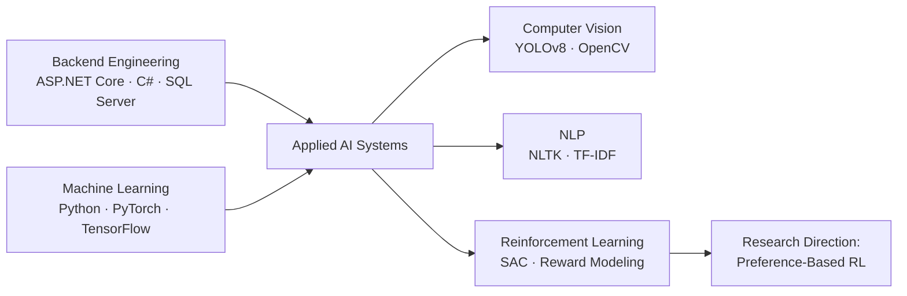
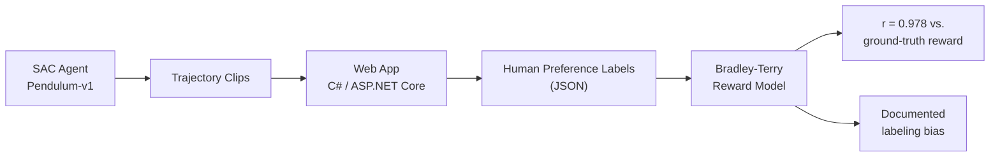
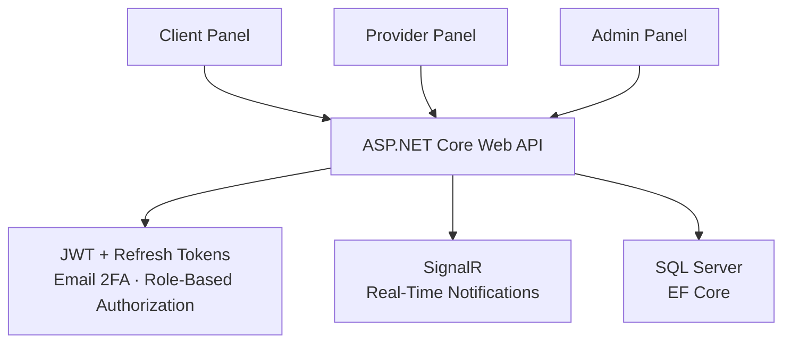

# Fatima Malikova

**Computer Engineering Student · Backend Engineer → Applied AI (Computer Vision, NLP, Reinforcement Learning)**

BSc Computer Engineering @ National Aviation Academy (2024–2028) · 
AI Intern @ CodeAlpha (Remote) 

---

## About

Backend engineer by foundation, applied-AI engineer by direction. I build production-style
systems with **ASP.NET Core, C#, and SQL Server** — JWT authentication, SignalR real-time
communication, role-based authorization — and apply machine learning to perception and
decision-making problems: NLP chatbots, real-time object detection with YOLOv8/OpenCV, and
preference-based reinforcement learning.

Currently co-authoring a Scopus-indexed research paper on a UAV trajectory-based ballistic
targeting system, submitted to *Advances in Military Technology (AIMT)*.

---

## Focus Areas

---

## Tech Stack

| Area | Technologies |
| --- | --- |
| **Languages** | C#, Python, Java, C++, JavaScript |
| **Backend** | ASP.NET Core Web API, ASP.NET Core MVC, REST API, Entity Framework Core, SignalR |
| **AI / ML** | PyTorch, TensorFlow, scikit-learn, NumPy, Pandas, OpenCV, YOLOv8, NLTK, Gymnasium, Stable-Baselines3 |
| **Database** | SQL Server |
| **Frontend** | HTML, CSS, JavaScript |
| **Tools** | Git, GitHub, Postman, Jupyter, Flask, GitHub Copilot |

---

## Experience

### Artificial Intelligence Intern — CodeAlpha (Remote)
*August 2026 – Present*

- Built an **NLP-powered FAQ chatbot** using NLTK for text preprocessing and TF-IDF with cosine
  similarity for intent matching, deployed behind a Flask web interface.
- Implemented a **real-time object detection & tracking system** with YOLOv8 and OpenCV, applying
  pre-trained deep learning models to detect and track objects across video frames with persistent IDs.
- Developed a **language translation tool** with a JavaScript UI, integrating a translation API with
  multi-language support, copy, and text-to-speech features.

---

## Selected Projects

### Preference-Based Reward Learning for RL (PEBBLE-Inspired)
*Independent Research · Python, PyTorch, C#/ASP.NET Core*

- Implemented a simplified reproduction of **PEBBLE** (Lee et al., ICML 2021), training a
  Bradley-Terry reward model from pairwise preference labels over RL trajectory clips.
- Built a full RL pipeline (Gymnasium, Stable-Baselines3, PyTorch): trained baseline **SAC** agents
  on continuous control (Pendulum-v1), extracted trajectory clips, and trained a reward model
  reaching **0.978 Pearson correlation** with ground-truth reward.
- Designed a companion web application (C#/ASP.NET Core) to collect real human preference labels,
  connected to the training pipeline through a JSON-based data flow.
- Identified and documented a systematic **human labeling bias**: the best clip by true reward was
  rejected in 100% of comparisons regardless of on-screen position — released as an open-source
  finding with full analysis and visualizations.

---

### UAV Ballistic Targeting System
*Research Lab Project · Scopus-indexed · Applied ML, Physics Modeling*

- Developing a trajectory-based targeting system for a projectile released from a UAV, computing
  release parameters that achieve a specified target impact angle.
- Co-authoring the accompanying research paper for submission to *Advances in Military Technology (AIMT)*.

---

### Web-based Appointment Booking System
*ASP.NET Core Web API · SQL Server · SignalR*

- Full-stack appointment management platform with separate **Client, Provider, and Admin** panels.
- Implemented JWT authentication with refresh tokens, email two-factor authentication (2FA),
  SignalR real-time notifications, and role-based authorization.
- Core features: appointment scheduling, real-time availability slots, multi-step booking workflow,
  and automated email reminders.
- Additional modules: social feed (posts, likes, comments, follows) and an admin-managed hero slider.

---

### ROOT — Smart Agrotourism Platform
*"Farm2Tour" Hackathon Project · 2026*

- Platform concept connecting farmers with tourists; contributed UX flow, market research, and
  pitch deck preparation.
- Designed and presented an MVP with the team within a 36-hour sprint.

---

## Education

**BSc in Computer Engineering** — National Aviation Academy · 09/2024 – 06/2028 · GPA 91.16/100
Relevant coursework: Data Structures and Algorithms, Computer Architecture, Computer Graphics, Machine Learning

**AI-assisted Programming** — CodeAcademy · 09/2025 – 08/2026
ASP.NET MVC and C# web applications, CRUD with Entity Framework Core and SQL Server, OOP principles,
backend–frontend integration, REST API development with ASP.NET Core

---

## Certifications

| Certification | Issuer |
| --- | --- |
| Supervised Machine Learning: Regression and Classification | DeepLearning.AI & Stanford University |
| Neural Networks and Deep Learning | DeepLearning.AI |
| AI for Everyone | DeepLearning.AI |
| The Full-Stack Developer Program | Meta |
| Node.js & MongoDB: Developing Back-End Applications | IBM |
| Software Engineer Certificate | HackerRank |
| Certificate of Achievement | ICPC |

---

## Languages

Azerbaijani (native) · Turkish (native) · English (upper-intermediate) · Russian (beginner) · Korean (beginner)

---

## Contact

- LinkedIn: https://www.linkedin.com/in/fatima-malikova-b00483378
- Email: fatiamalikova@gmail.com
